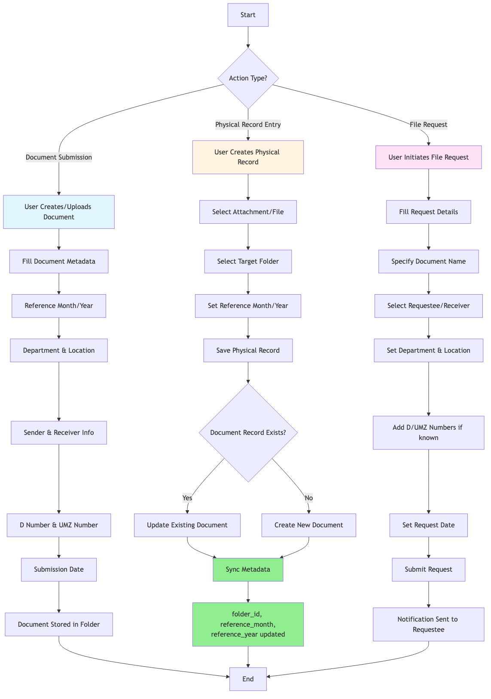
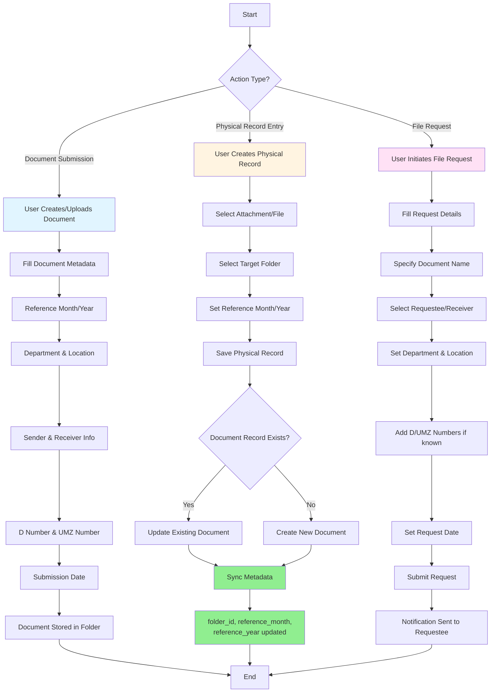
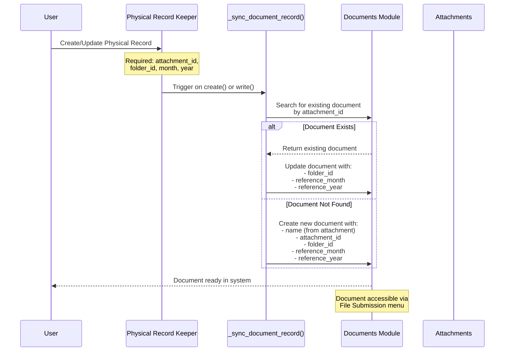
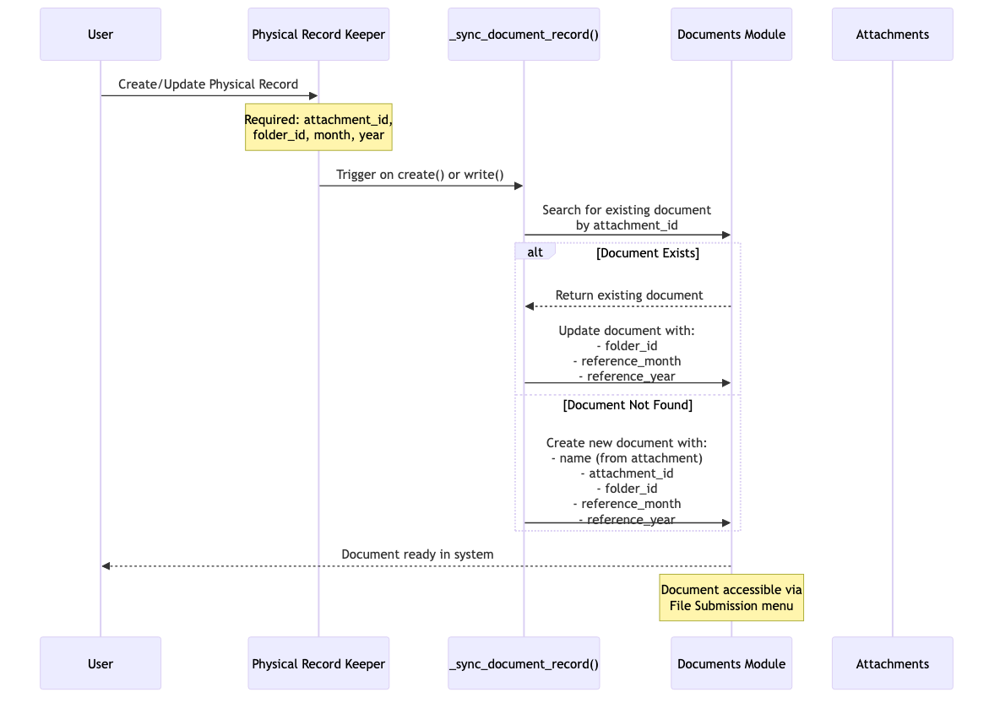
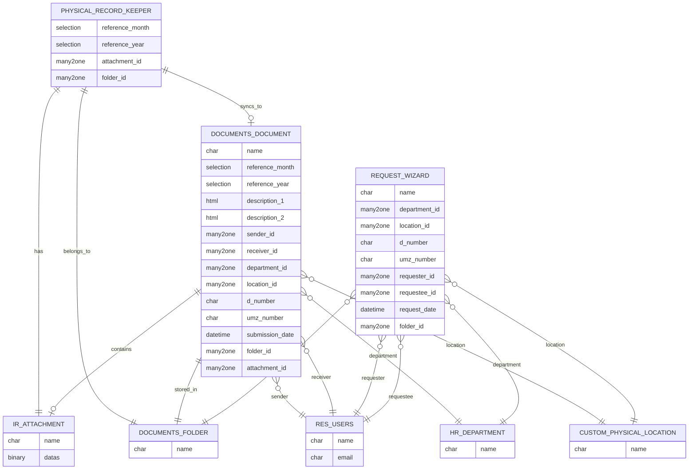
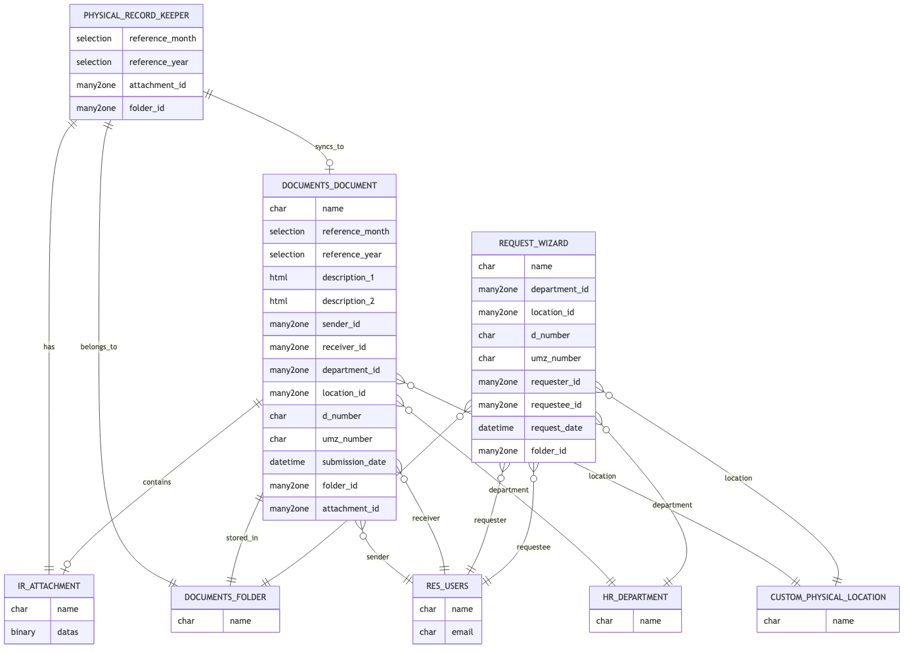

# Documents File Plan Module Documentation

**Module:** documents_file_plan
**Version:** 18.0.1.0.0
**Author:** Nated Systems
**Date:** February 6, 2026

---

## Executive Summary

The **Documents File Plan** module is a comprehensive document management extension that bridges physical document records with Odoo's digital document system. It adds file plan categorization, tracking, and workflow capabilities for managing documents with temporal references (month/year) and organizational metadata.

---

## Module Purpose
The Documents File Plan module is a document management extension that bridges physical document records with Odoo's digital document system. It adds file plan categorization, tracking, and workflow capabilities for managing documents with temporal references (month/year) and organizational metadata.

This module extends Odoo's document management capabilities by:

- Providing structured file plan organization by time periods (month/year)
- Integrating physical document records with the digital document system
- Enabling document tracking by department and physical location
- Supporting sender/receiver workflow tracking
- Managing unique document reference numbers (D Number, UMZ Number)
- Facilitating document request and submission workflows

---

## Key Features
1. Document Categorization: Tracks documents by month, year, department, and physical location
2. Sender/Receiver Tracking: Records who sends and receives files
3. Reference Numbers: Supports D Number and UMZ Number tracking
4. Two-way Sync: Automatically synchronizes Physical Record Keeper with Documents module
5. Request Workflow: Allows users to request files from others
6. Submission Workflow: Structured document submission process

## Key Processes
**1. Document Submission Process (Blue Path)**
Users upload documents directly through the File Submission menu
Metadata includes: month/year references, sender/receiver, department, location, D/UMZ numbers
Documents are organized in folders for easy retrieval

**2. Physical Record Synchronization (Yellow Path)**
When a physical record is created/updated, the system automatically:
Checks if a document record exists for that attachment
Updates the existing document OR creates a new one
Syncs folder, month, and year metadata
This ensures physical records are always reflected in the digital document system

**3. File Request Workflow (Pink Path)**
Users can request files from other users
Tracks requester, requestee, department, location
Creates a traceable request record with metadata

## Core Innovation
The module's main value is the automatic bidirectional sync between Physical Record Keeper and Documents module через the _sync_document_record() method, which triggers on every create/write operation to maintain data consistency.

**Menu Structure**
**1. File Submission:** Direct document upload interface
**2. File Request:** Request wizard for file requests
3. Both are accessible from the Documents menu
The module effectively creates a file plan system that organizes documents by time (month/year) and organizational structure (department/location) while maintaining seamless integration between physical record tracking and digital document management.



### 1. Document Categorization
- **Temporal Organization**: Track documents by month and year (50 years back, 20 years forward)
- **Organizational Structure**: Associate documents with departments and physical locations
- **Reference Numbers**: Support for D Number and UMZ Number tracking
- **Flexible Year Range**: Dynamic year selection from 1976 to 2046

### 2. Sender/Receiver Tracking
- Record who sends files (defaults to current user)
- Track who receives files
- Maintain submission dates and timestamps
- Create audit trail for document transfers

### 3. Two-way Synchronization
- Automatic sync between Physical Record Keeper and Documents module
- Create or update document records based on physical records
- Maintain metadata consistency across systems
- Triggered automatically on create/update operations

### 4. Request Workflow
- Users can request files from other users
- Track requester and requestee information
- Include department and location context
- Record request dates for follow-up

### 5. Submission Workflow
- Structured document submission process
- Rich metadata capture (2 HTML description fields)
- Folder-based organization
- Multi-view support (list, form, kanban, activity)

### 6. Advanced Search and Filtering
- Filter by month, year, department, location
- Search by D Number or UMZ Number
- Group by folder, month, or year
- Multi-field search capabilities

---

## Technical Architecture

### Module Dependencies
- **documents**: Core Odoo documents module
- **physical_document_records_manage**: Physical records management system

### Models Extended

#### 1. documents.document
**New Fields:**
- `reference_month`: Selection field (January-December)
- `reference_year`: Selection field (dynamic year range)
- `description_1`: HTML field for detailed description
- `description_2`: HTML field for additional description
- `sender_id`: Many2one link to res.users (default: current user)
- `receiver_id`: Many2one link to res.users
- `department_id`: Many2one link to hr.department
- `location_id`: Many2one link to custom.physical.location
- `d_number`: Character field
- `umz_number`: Character field
- `submission_date`: Datetime field

#### 2. documents.request_wizard
**New Fields:**
- `department_id`: Many2one link to hr.department
- `location_id`: Many2one link to custom.physical.location
- `d_number`: Character field
- `umz_number`: Character field
- `requester_id`: Many2one link to res.users (default: current user)
- `request_date`: Datetime field

#### 3. physical.record.keeper.custom
**New Fields:**
- `reference_month`: Selection field (required)
- `reference_year`: Selection field (required)
- `attachment_id`: Many2one link to ir.attachment (required)
- `folder_id`: Many2one link to documents.document (required, folder type only)

**New Methods:**
- `_sync_document_record()`: Synchronizes physical records with document records

---

## Process Workflows


### Complete Process Flow Diagram




---

### Workflow 1: Document Submission Process

**Steps:**
1. User navigates to File Submission menu
2. User creates/uploads a new document
3. System prompts for metadata:
   - Document name
   - File upload
   - Reference month and year
   - Department and location
   - Sender and receiver information
   - D Number and UMZ Number (if applicable)
   - Submission date
   - Description fields
4. Document is saved to selected folder
5. Document becomes searchable and accessible

**User Interface:**
- Custom list view with month/year columns
- Enhanced form view with all metadata fields
- Kanban and activity views available
- Multi-edit support for bulk operations

---

### Workflow 2: Physical Record Synchronization

**Steps:**
1. User creates or updates a Physical Record
2. User selects:
   - Attachment/File (required)
   - Target Folder (required)
   - Reference Month (required)
   - Reference Year (required)
3. System triggers `_sync_document_record()` method
4. System searches for existing document with same attachment
5. **If document exists:**
   - System updates existing document
   - Updates folder_id, reference_month, reference_year
6. **If document doesn't exist:**
   - System creates new document
   - Populates name from attachment
   - Sets attachment_id, folder_id, reference_month, reference_year
7. Document is now accessible via File Submission menu

**Technical Details:**
```python
def _sync_document_record(self):
    """Sync documents.document based on the current attachment/folder/month/year."""
    for record in self:
        if not record.attachment_id or not record.folder_id:
            continue  # Skip incomplete rows

        doc = self.env['documents.document'].sudo().search([
            ('attachment_id', '=', record.attachment_id.id)
        ], limit=1)

        doc_vals = {
            'folder_id': record.folder_id.id,
            'reference_month': record.reference_month,
            'reference_year': record.reference_year,
        }

        if doc:
            doc.write(doc_vals)
        else:
            self.env['documents.document'].sudo().create({
                'name': record.attachment_id.name,
                'attachment_id': record.attachment_id.id,
                'folder_id': record.folder_id.id,
                'reference_month': record.reference_month,
                'reference_year': record.reference_year,
            })
```

**Synchronization Sequence Diagram:**






---

### Workflow 3: File Request Process

**Steps:**
1. User navigates to File Request menu
2. User clicks "Create" to open request wizard
3. User fills in request details:
   - Document name or description
   - Requestee (person to request from)
   - Folder where document should be located
   - Department and location (if known)
   - D Number and UMZ Number (if known)
   - Requester (defaults to current user)
   - Request date
4. User clicks "Request" button
5. System creates request record
6. Notification sent to requestee
7. Request tracked for follow-up

**User Interface:**
- List view showing all requests
- Form view with request button in header
- Fields for requester, requestee, department, location

---

## Data Model


### Entity Relationships

**DOCUMENTS_DOCUMENT** (Core document entity)
- Contains files or references to files
- Linked to folder, sender, receiver, department, location
- Has temporal references (month/year)
- Has unique identifiers (D/UMZ numbers)

**PHYSICAL_RECORD_KEEPER** (Physical records tracking)
- Linked to attachment and folder
- Has temporal references (month/year)
- Automatically syncs to DOCUMENTS_DOCUMENT

**REQUEST_WIZARD** (File request tracking)
- Links requester and requestee (users)
- Specifies target folder, department, location
- Includes reference numbers for identification

### Entity Relationship Diagram





### Key Relationships
- Physical Record Keeper → Documents Document (one-to-one sync)
- Documents Document → IR Attachment (one-to-one)
- Documents Document → Documents Folder (many-to-one)
- Documents Document → Users (many-to-one for sender/receiver)
- Documents Document → HR Department (many-to-one)
- Documents Document → Physical Location (many-to-one)

---

## User Interface Components

### Menu Structure

**Documents Module Menu:**
1. **File Submission** (Sequence: 2)
   - Path: documents_submission
   - Views: List, Form, Kanban, Activity
   - Domain: Binary documents only
   - Purpose: Direct document upload and management

2. **File Request** (Sequence: 3)
   - Views: List, Form
   - Purpose: Request files from other users

**Physical Record Keeper Menu:**
1. **File Submission** (Sequence: 13)
   - Linked to document submission action

2. **File Request** (Sequence: 14)
   - Linked to request wizard action

### Views

#### List View Enhancements
- Added reference_month column
- Added reference_year column
- Multi-edit capability
- Sorting by folder, creation date
- Display of document count

#### Form View Enhancements
- Two-column layout with grouped fields
- Left column: File, folder, sender, receiver, location, department, submission date
- Right column: Type, dates, creator, lock status, month, year, reference numbers
- Description fields for detailed notes
- Access/Download/Lock/Unlock buttons in header
- Chatter for communication

#### Search View Enhancements
- Search by file, folder, month, year
- Group by month and year filters
- Combined with existing document search capabilities

---

## Business Use Cases

### Use Case 1: Monthly Report Filing
**Scenario:** HR department needs to file monthly payroll reports

**Steps:**
1. HR manager uploads January 2026 payroll report
2. Sets reference month to "January" and year to "2026"
3. Sets department to "Human Resources"
4. Adds sender (self) and receiver information
5. Document is filed and easily retrievable by month/year

**Benefits:**
- Organized by time period
- Easy retrieval of specific month's reports
- Audit trail maintained

---

### Use Case 2: Physical File Digitization
**Scenario:** Records department is digitizing physical archives

**Steps:**
1. Clerk scans physical document to PDF
2. Creates Physical Record entry
3. Attaches scanned PDF
4. Selects target folder and month/year
5. System automatically creates Document record
6. Physical and digital records are linked

**Benefits:**
- Seamless physical-to-digital transition
- No duplicate data entry
- Maintains consistency between systems

---

### Use Case 3: Cross-Department File Request
**Scenario:** Legal needs a document from Finance

**Steps:**
1. Legal staff member opens File Request
2. Creates request specifying:
   - Document needed (by D Number)
   - Requestee: Finance Manager
   - Department: Finance
3. Finance Manager receives notification
4. Finance Manager uploads or shares document
5. Legal receives access to document

**Benefits:**
- Formal request tracking
- Clear accountability
- Documented file transfers

---

## Search and Filtering Capabilities

### Available Filters

**By Time Period:**
- Month (January through December)
- Year (1976 - 2046)
- Creation date
- Submission date
- Request date

**By Organization:**
- Department
- Physical location
- Folder

**By People:**
- Sender
- Receiver
- Requester
- Requestee
- Creator
- Lock owner

**By Identifiers:**
- Document name
- D Number
- UMZ Number
- Attachment/File name

### Grouping Options
- Group by folder
- Group by month
- Group by year
- Group by department
- Group by location

---

## Security Considerations

### Access Control
- Inherits from base documents module security
- Sender defaults to current user (prevents spoofing)
- Requester defaults to current user
- Sudo access used for sync operations (ensures consistency)

### Data Integrity
- Required fields enforced on Physical Record (attachment, folder, month, year)
- Synchronization happens automatically (no manual intervention)
- Domain restrictions ensure folders only (not files) selected as destinations

---

## Configuration Requirements

### Prerequisites
- Odoo Documents module installed and configured
- Physical Document Records Management module installed
- HR module (for department data)
- Users configured with proper access rights

### Setup Steps
1. Install documents_file_plan module
2. Configure document folders structure
3. Set up physical locations (custom.physical.location)
4. Configure departments (if not already done)
5. Train users on file submission and request workflows

---

## Technical Specifications

### Year Range Function
```python
@staticmethod
def year_range_selection(start_offset, end_offset, steps=1):
    current_year = fields.Datetime.now().year
    return [(str(year), str(year)) for year in range(
        current_year - start_offset,
        current_year + end_offset,
        steps
    )]
```
- Dynamic calculation based on current year
- Supports 50 years backward, 20 years forward
- Configurable step parameter (default: 1 year)

### Auto-Sync Trigger Points
- Triggered on `create()` method of Physical Record Keeper
- Triggered on `write()` method of Physical Record Keeper
- Executes in sudo mode for reliable permissions
- Searches by attachment_id for existing records
- Creates or updates as needed

---

## Reporting and Analytics

### Available Reports
- Documents grouped by month and year
- Documents by department
- Documents by location
- Documents by sender/receiver
- Request tracking reports

### Data Export
- Standard Odoo export functionality available
- Export filtered lists to Excel/CSV
- Include all custom fields in exports

---

## Best Practices

### For Document Management
1. Always specify month and year for time-sensitive documents
2. Use consistent folder structure across departments
3. Fill in D Number and UMZ Number when available
4. Provide meaningful descriptions in description fields
5. Set sender and receiver for accountability

### For Physical Record Synchronization
1. Ensure attachment is uploaded before saving physical record
2. Select appropriate target folder matching document type
3. Verify month and year are correct before saving
4. Review synchronized document record for accuracy

### For File Requests
1. Be specific in request name/description
2. Include all known identifiers (D/UMZ numbers)
3. Specify department and location to help requestee
4. Follow up on pending requests regularly

---

## Troubleshooting

### Common Issues

**Issue:** Document not appearing after physical record creation
- **Solution:** Verify attachment_id and folder_id are set
- Check that record was saved successfully
- Verify user has access to target folder

**Issue:** Cannot find document by month/year
- **Solution:** Ensure month and year fields were populated
- Check filter settings in search view
- Verify grouping is set correctly

**Issue:** Request not received
- **Solution:** Verify requestee user is active
- Check notification settings
- Ensure proper email configuration

---

## Future Enhancements

### Potential Improvements
- Automated retention policy based on month/year
- Bulk upload with automatic month/year detection
- Integration with external file storage systems
- Advanced analytics dashboard
- Mobile application support
- Barcode/QR code generation for physical files
- Email integration for document submission

---

## Support and Maintenance

**Developer:** Nated Systems
**Website:** https://natedsystems.co.za
**Module Path:** /documents_file_plan/
**License:** AGPL-3

### Module Files
- `__init__.py`: Module initialization
- `__manifest__.py`: Module metadata and dependencies
- `models/documents_document.py`: Document model extensions
- `models/physical_record_keeper.py`: Physical record synchronization
- `views/documents_document_view.xml`: Document views and actions
- `views/physical_record_keeper_view.xml`: Physical record views

---

## Conclusion

The Documents File Plan module provides a comprehensive solution for managing documents with temporal and organizational context. Its automatic synchronization between physical and digital records ensures data consistency, while the request workflow facilitates inter-departmental document sharing. The flexible filtering and grouping capabilities make it easy to organize and retrieve documents based on various criteria.

Key benefits include:
- **Organized Structure**: Time-based and department-based organization
- **Automation**: Automatic sync reduces manual work and errors
- **Traceability**: Complete audit trail of document movements
- **Flexibility**: Customizable for various document types and workflows
- **Integration**: Seamless integration with Odoo's document management ecosystem

This module is ideal for organizations that need structured document management with physical-digital integration and strong organizational categorization capabilities.

---

**Document Version:** 1.0
**Last Updated:** February 6, 2026
**Status:** Production Ready
