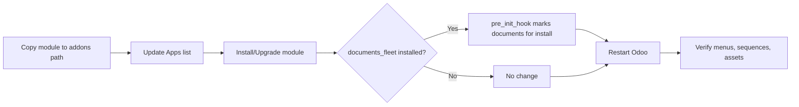
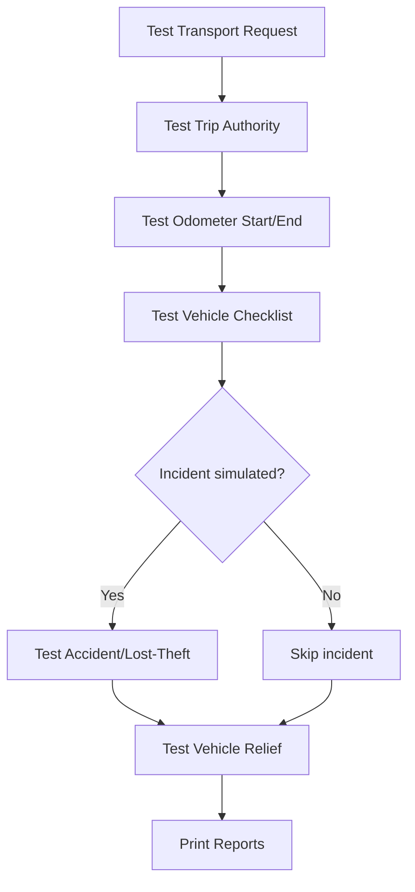

# Enhanced Fleet Management – Technical & Setup Guide

## 1) Prerequisites
- Odoo 18 (Enterprise) installed and running.
- Python 3.10+ with `pip`.
- Access to install/upgrade Odoo modules and restart the Odoo service.
- If using document linking: `documents` and `documents_fleet` available.

## 2) Install steps
1. Copy `enhanced_fleet_management/` into your addons path.
2. Update Apps list, then install “Enhanced Fleet Management”.
3. To upgrade: click Upgrade on the module.
4. Restart the Odoo service to load assets and hooks.

### Install/Upgrade flow (diagram)



## 3) Dependencies (manifest)
- Core: `base`, `fleet`, `hr`, `mail`, `web`.
- Optional: `documents`, `documents_fleet` (pre_init_hook marks documents for install when documents_fleet is present).

## 4) Post-install configuration
- Sequences: Settings → Technical → Sequences → confirm fleet sequences from `data/sequence_data.xml`.
- Email: configure outgoing mail server for notifications.
- Security groups: assign users to Fleet User, Fleet Manager, Incident Officer (for accidents/loss/theft).
- Demo (optional): install with demo data to load `data/demo_data.xml`.

### Configuration flow (diagram)

```mermaid
flowchart LR
  A[Install module] --> B[Set sequences]
  B --> C[Configure mail server]
  C --> D[Assign security groups]
  D --> E[Load demo data (optional)]
  E --> F[Smoke-test flows]
```

## 5) Key models & reports
- Transport Requests: `fleet.transport.request` (+ PDF report).
- Trip Authorities: `fleet.trip.authority` (+ PDF report).
- Vehicle Checklists: `fleet.vehicle.checklist` (+ PDF report).
- Accident Reports (RT46): `fleet.accident.report` (+ PDF report).
- Lost/Theft: `fleet.lost.theft` (+ PDF report).
- Vehicle Relief: `fleet.vehicle.relief` (+ PDF report).
- Odometer Readings: `fleet.odometer.reading` (+ PDF report).

## 6) Assets
- Registered in `__manifest__.py` under `web.assets_backend`:
  - `static/src/css/fleet_management.css`
  - `static/src/js/fleet_dashboard.js`
  - `static/src/xml/fleet_dashboard.xml`

## 7) Hooks
- `pre_init_hook(env)` uses `env.cr` to mark `documents` for install when `documents_fleet` is already present.

## 8) Testing checklist
- Create/approve Transport Request.
- Issue Trip Authority from an approved request.
- Record Odometer (start/end) and verify.
- Run Vehicle Checklist (pre/post trip) and compute roadworthiness.
- File Accident report (RT46) and progress through claim/closure.
- File Lost/Theft report and track recovery/prevention.
- Process Vehicle Relief (submit → approve → assign → handover/return) and costs.
- Print each PDF report.

### End-to-end verification flow (diagram)



## 9) Deployment tips
- Restart Odoo after install/upgrade.
- To reload: `odoo-bin -u enhanced_fleet_management --load=web,base` (adjust path/env as needed).
- Backup database before upgrades.

## 10) Conversion to Word
Pandoc is installed; from the repo root run:
```
pandoc technical_setup.md -o technical_setup.docx
```