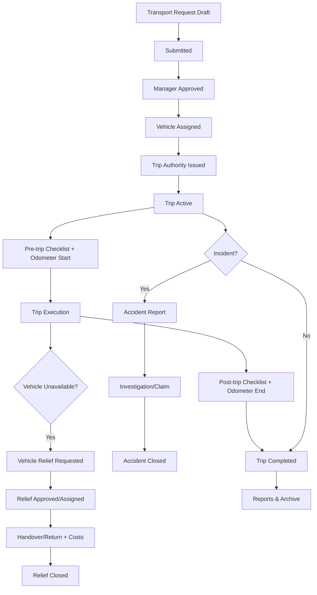
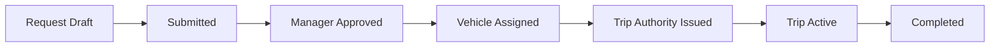
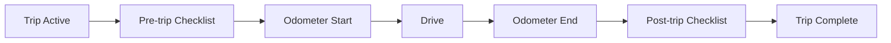
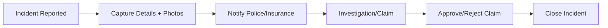
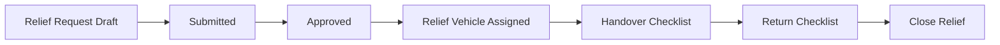

# Enhanced Fleet Management – User Guide

## Core flows (overview)
1) Transport Request → submit → manager approves → fleet assigns vehicle/driver → start trip → complete → print PDF.
2) Trip Authority → issue sequential number → activate trip → complete → print PDF.
3) Vehicle Checklist → pre/post trip or periodic → compute condition/roadworthy → attach photos → print PDF.
4) Odometer Reading → log (routine/departure/arrival) → verify → flag suspicious → attach photos → print PDF.
5) Accident Report (RT46) → report → investigate → claim → approve/reject → close → print PDF.
6) Lost/Theft → log incident → police/insurance info → recovery → preventive actions → print PDF.
7) Vehicle Relief → submit → approve → assign relief vehicle → handover/return checklists, costs → close → print PDF.

### Process landscape (end-to-end) – flow diagram



## Navigation
- Fleet menu: Transport Requests, Trip Authorities, Vehicle Checklists, Odometer Readings, Accident Reports, Lost & Theft, Vehicle Relief.
- Vehicle form buttons: view related requests, trips, checklists; enhanced tabs for category, contracts, insurance.

## Roles & permissions
- Fleet User: create/view own records.
- Fleet Manager: approvals, assignments, closures.
- Incident Officer: accidents and loss/theft handling.

## Notifications
- Email notifications on submission, approvals, claims, and key workflow steps (ensure outgoing mail server is configured).

## Reports
- Each object provides a Print action; PDFs match the original departmental forms.

## End-to-end step-by-step (happy path)
1) User submits Transport Request (date, route, passengers, priority).
2) Manager approves.
3) Fleet Manager assigns vehicle/driver; Trip Authority generated.
4) Trip Authority issued; trip starts.
5) Pre-trip Checklist; Odometer start recorded.
6) Trip executed; Odometer end recorded.
7) Post-trip Checklist; Trip completed.
8) If incident: Accident or Lost/Theft report filed; claim/investigation processed.
9) If vehicle unavailable: Vehicle Relief raised, approved, relief vehicle assigned, handover/return tracked.
10) Reports printed for audit; dashboards show counts/status.

### Per-process quick flows (diagrams)
**Transport Request → Trip Authority**



**Checklist & Odometer pairing**



**Incident handling (Accident or Lost/Theft)**



**Vehicle Relief**



## Process flowchart (Mermaid text)
See the “Process landscape (end-to-end)” diagram above for the consolidated flow.

## Quick actions by role
- Requester: create/submit transport requests; view own trips.
- Manager: approve requests; review incidents.
- Fleet Manager: assign vehicles/drivers; issue trip authorities; oversee checklists/odometer; close incidents; manage relief.
- Incident Officer: handle accidents and loss/theft investigations.

## Conversion to Word
Pandoc is installed; from the repo root run:
```
pandoc user_guide.md -o user_guide.docx
```