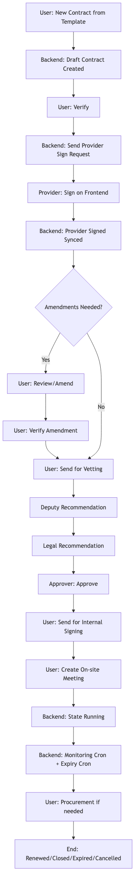
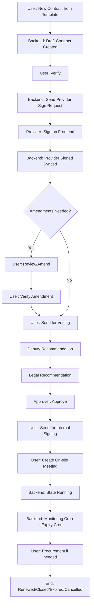

# ECDHS Contract Management
## First-Time User Guide by Role (Step-by-Step)

Version date: 2026-03-30
Audience: Users who have never used Odoo before

## 1. Before You Start
### Login and Basic Navigation
1. Open your Odoo URL in browser.
2. Sign in with your assigned user account.
3. Click the App launcher and open Contract Management.
4. Use breadcrumb navigation at top-left to move between list and form views.
5. Use Save button after every edit before running workflow actions.

### Important UI Areas
- Top header buttons: workflow actions
- Statusbar: shows current state
- Notebook tabs: details by section
- Chatter (bottom): messages, activities, and audit logs

## 2. Role Guide: Contract User (Requestor/Owner)
### Goal
Create, prepare, and progress contracts through verification, supplier sign, and execution.

### Steps
1. Go to Contract Management > Configuration > New Contract from Template.
2. Select template, service provider, amount, start/end dates.
3. Complete Scope of Work, Terms of Reference, Terms and Conditions.
4. Click Create Contract.
5. In the new contract, review all fields and documents.
6. Click Verify.
7. Click Send for Provider Signing.
8. After supplier signs, click Confirm Provider Signed.
9. If supplier requests changes, enter amendment notes and click Review / Amend.
10. After updates, click Verify Amendment.
11. Continue to vetting by clicking Send for Vetting.
12. Track progress in chatter and statusbar.

Where to click:
- Contract form header buttons
- Documents tab for attachments
- Scope of Work tab for scope updates

Expected outcomes:
- State moves from Draft to Verify to Sent to Service Provider and onward.
- Notifications are sent automatically.

## 3. Role Guide: Team Leader
### Goal
Set up approval teams and approver sequence.

### Steps
1. Go to Contract Management > Configuration > Contract Approval Teams.
2. Click New.
3. Enter team name and team leader.
4. In Approvers tab, add users in sequence order.
5. Set role title, can-edit flag, min/max amount thresholds.
6. Save team.
7. Ask contract users to select this team in their contract.

Where to click:
- Configuration menu > Contract Approval Teams
- Approvers list inside team form

Expected outcomes:
- Approval routing is generated when contract is confirmed.

## 4. Role Guide: Contract Manager
### Goal
Oversee templates, approve amendments, and manage exceptions.

### Steps
1. Go to Configuration > Contract Templates.
2. Create or update template body and variables.
3. Confirm New Contract from Template menu is available under Configuration.
4. Review contracts in list/kanban.
5. Open Amendments menu to approve/reject submitted amendments.
6. Validate variation order percentage compliance and treasury approvals where needed.

Where to click:
- Configuration > Contract Templates
- Amendments menu
- Contract header/state and amendment tabs

Expected outcomes:
- Controlled template usage and amendment governance.

## 5. Role Guide: Deputy Director
### Goal
Provide deputy recommendation during vetting path.

### Steps
1. Open contract in state Send for Vetting.
2. Fill Recommend By Deputy Director field on Recommend tab.
3. Click Recommend: Deputy Director.

Where to click:
- Recommend tab
- Header button Recommend: Deputy Director

Expected outcomes:
- Contract state moves to Recommend By Deputy Director.

## 6. Role Guide: Legal Services
### Goal
Provide legal recommendation and ensure policy compliance.

### Steps
1. Open contract in state Recommend By Deputy Director.
2. Fill Recommend By Legal Services Department field.
3. Click Recommend: Legal Services.
4. Confirm legal recommendation is present for contracts >= R500,000 before approval.

Where to click:
- Recommend tab legal field
- Header button Recommend: Legal Services

Expected outcomes:
- Contract can proceed to approval path.

## 7. Role Guide: Approver/CFO
### Goal
Issue formal approval and push contract to internal signing.

### Steps
1. Open contract in recommendation-complete state.
2. Review amount, risk, legal recommendation, and documents.
3. Click Approve.
4. Click Send for Internal Signing once provider sign is confirmed.

Where to click:
- Header buttons Approve and Send for Internal Signing

Expected outcomes:
- Contract moves to approval/signing states.

## 8. Role Guide: Monitoring Officer
### Goal
Track performance and manage non-compliance and termination flows.

### Steps
1. Open Service Monitoring menu.
2. Create/open monitoring report for running contract.
3. Record findings and actions.
4. If needed, click Send Non-Complaince.
5. If severe, click Request Termination.
6. Follow approval/refusal actions as required.

Where to click:
- Service Monitoring menu
- Monitoring report form header buttons

Expected outcomes:
- Compliance trail and escalation history captured.

## 9. Role Guide: Procurement Officer
### Goal
Handle replacement sourcing when contract expiry or termination requires it.

### Steps
1. Open contract in Running state.
2. Click Create Procurement.
3. Fill end user, reason, notes.
4. Click Submit.
5. When process is complete, click Mark Completed.

Where to click:
- Contract header button Create Procurement
- Procurement Requests form buttons

Expected outcomes:
- Procurement lifecycle tracked and linked to contract.

## 10. Role Guide: Service Provider (External)
### Goal
Review and sign assigned contract request.

### Steps
1. Open email invitation for signing.
2. Click Open Contract link.
3. Review contract terms and sign.
4. Submit signature.

Expected system sync:
- Signature status updates in backend sign request.
- Internal user confirms provider signed and process continues.

## 11. Role Guide: System Administrator
### Goal
Enable settings, maintain permissions, and monitor automation.

### Steps
1. Open Settings and verify Contract Management options.
2. Ensure users are assigned to correct groups and roles.
3. Check scheduled actions (cron):
   - Contract Monitoring Reports (daily)
   - Contract Expiry Notices (monthly)
4. Monitor logs/chatter for failures.

Where to click:
- Settings > Technical > Scheduled Actions
- Users & Companies > Users > Access Rights

## 12. BPMN Process Flowchart (User Journey)
### Swimlanes
- Internal User
- Service Provider
- Deputy/Legal/Approver
- Odoo Backend

### Flow Summary
1. Internal user creates contract from template.
2. Backend stores contract in Draft.
3. Internal user verifies.
4. Backend dispatches provider signing request.
5. Service provider signs on frontend.
6. Backend syncs signing status.
7. Internal team processes amendments and vetting.
8. Deputy and legal recommendations captured.
9. Approver approves and internal sign is completed.
10. Contract goes Running after on-site meeting.
11. Backend automations execute monitoring and expiry notices.
12. Procurement flow may be triggered.
13. Contract closes/renews/expires.

### Mermaid Source (for rendered flowchart)
Rendered image for Word/PDF:

## 13. Screenshot Checklist and Placement
Use these screenshots in this order:
1. Contracts list view
2. Contract form with header actions
3. New Contract from Template wizard
4. Verify and provider signing actions
5. Recommend tab and recommendation buttons
6. Approval and signing stages
7. Service Monitoring report screen
8. Procurement request form
9. Amendment form and status flow
10. Chatter activity and expiry task

Existing sample images available:
- xf_partner_contract/static/description/contracts_list.png
- xf_partner_contract/static/description/contracts_kanban.png
- xf_partner_contract/static/description/contract_approval_buttons.png
- xf_partner_contract/static/description/contract_under_approval.png
- xf_partner_contract/static/description/contract_running.png
- xf_partner_contract/static/description/contract_logs.png

## 14. First-Time User Tips
- Always Save before clicking a state transition button.
- Read any validation message fully; it usually tells what is missing.
- Use chatter as your audit timeline.
- Do not bypass provider signing step; internal signing is blocked without it.
- For high-value contracts, complete legal recommendation first.

---
End of guide
---

Use this as the practical playbook in your current Odoo setup.

## 0. One-Time Setup
1. Create templates:
- Go to Contract Management > Configuration > Contract Templates
- Create templates for SLA, Service Agreement, Funding Agreement, etc.
- Include default Scope of Work and TOR text.

2. Set user roles:
- Assign users to contract groups (user, manager, deputy, legal, CFO) so approval buttons appear for the right people.

3. (Recommended) Install/enable Odoo Sign:
- If Sign is enabled, provider signing is digital.
- If not enabled, provider-sign steps can be tracked manually in the workflow state.

## 1. Contract Creation (Template-Driven)
1. Go to Contract Management > Configuration > New Contract from Template.
2. Select:
- Contract Template
- Service Provider (partner)
- Amount
- Start/End dates
- Contract title
3. Fill/edit:
- Scope of Work
- TOR
- Terms/notes
4. Click Create Contract.

Result:
- Contract record is created in Draft with template-linked content.

## 2. Contract Rendering (PDF Generation)
1. Open the created contract.
2. Use Print > Contract Document.
3. Odoo generates the PDF via QWeb report.

Result:
- You get a generated contract PDF with merged contract data.

## 3. External Signing (Provider First)
1. From Draft, click Verify.
2. Click Send for Provider Signing.
3. Provider receives signing request (if Sign is enabled) and signs.
4. Internal user confirms completion using Confirm Provider Signed.

Result:
- Contract moves through provider-sign stage before internal finalisation.

## 4. Amendment / Negotiation Loop
If provider requests changes:
1. Capture requested changes in amendments fields/records.
2. Click Review / Amend.
3. Update contract content.
4. Click Verify Amendment.
5. Repeat as needed until both parties are aligned.

Result:
- Controlled negotiation loop with state history and traceability.

## 5. Internal Approval Workflow
After provider sign/amendment close:
1. Click Send for Vetting.
2. Deputy role enters recommendation and clicks Recommend: Deputy Director.
3. Legal role enters recommendation and clicks Recommend: Legal Services.
4. Approver clicks Approve.
5. Click Send for Internal Signing.

Result:
- Sequential internal governance path is completed.

## 6. Finalisation & Activation
1. After internal signing, click Create On-site Meeting.
2. Contract moves to Running / Active.
3. Keep final signed docs in contract documents/attachments.

Result:
- Contract is fully executed and operational.

## 7. Optional Enhancements (Already aligned in your flow)
1. Expiry notifications:
- Monthly automated notices for contracts nearing end date.
2. Monitoring:
- Service Monitoring records for compliance/performance.
3. Procurement continuation:
- Create Procurement request from running contract if renewal/replacement is needed.

## Quick “Happy Path” Click Sequence
1. New Contract from Template
2. Create Contract
3. Verify
4. Send for Provider Signing
5. Confirm Provider Signed
6. Send for Vetting
7. Recommend Deputy
8. Recommend Legal
9. Approve
10. Send for Internal Signing
11. Create On-site Meeting

---
---
---
In the data file to be created on install or upgrade of module Create templates for SLA, Service Agreement, Funding Agreement, etc. Include default Scope of Work and TOR text

- Also create dummy Approval Teams with these users distributed amongst the teams
HOD / MM / CEO (configurable hierarchy)
Followed by Finance (e.g., CFO)
users to contract groups (user, manager, deputy, legal, CFO)
Deputy Director
Legal Services.
Approver
and any other users
assign them also to the relevant groups e.g Assign users to contract groups (user, manager, deputy, legal, CFO)  and

Provide their login details e.g
Username: CFO
Password: CFO@1234
---
---
---

**File created:** contract_setup_data.xml
**Registered in:** __manifest__.py

---

### Contract Templates (6) — refresh on every upgrade
| Template | Type |
|---|---|
| Service Level Agreement (SLA) | Vendor Contract |
| Service Agreement | Vendor Contract |
| Funding Agreement | Vendor Contract |
| Memorandum of Understanding (MOU) | Vendor Contract |
| Retainer Agreement | Vendor Contract |
| Deed of Sale | Vendor Contract |

Each includes full **Scope of Work** and **Terms of Reference (TOR)** HTML.

---

### Users — created once, passwords preserved on upgrade
| Full Name | Login | Password | Group |
|---|---|---|---|
| Head of Department | `hod` | `HOD@1234` | Manager |
| Municipal Manager | `mm` | `MM@1234` | Manager |
| Chief Executive Officer | `ceo` | `CEO@1234` | CFO (top level) |
| Chief Financial Officer | `cfo` | `CFO@1234` | CFO (top level) |
| Deputy Director | `deputy` | `Deputy@1234` | Deputy Director |
| Legal Services Officer | `legal` | `Legal@1234` | Legal Advisor |
| Contract Manager | `contract_manager` | `Manager@1234` | Manager |
| Contract User | `contract_user` | `User@1234` | User |
| Contract Approver | `approver` | `Approver@1234` | Team Leader |

---

### Approval Teams (3)
| Team | Approval Chain |
|---|---|
| Standard Governance Approval Chain | HOD (10) → MM (20) → CEO (30) → CFO (40) |
| Legal and Finance Approval Team | Deputy Director (10) → Legal Services (20) → CFO (30) |
| SCM Procurement Review Team | Contract Manager (10) → HOD (20) → CFO (30) → CEO (40) |
