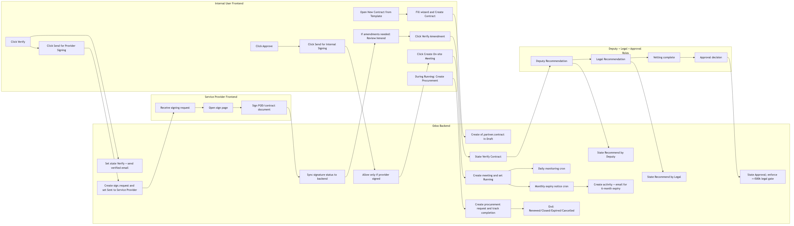
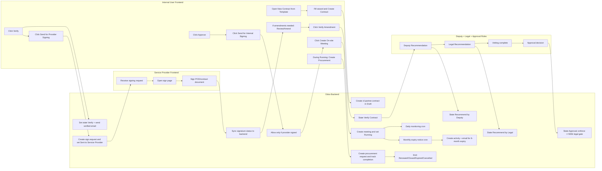

# ECDHS Contract Management
## End-to-End Workflow, Variants, and BPMN User Journey

Version date: 2026-03-30
System: Odoo 18 (ECDHS instance)

## 1. Purpose
This document explains the full contract workflow from initiation to completion, including alternate flows, role handoffs, front-end user actions, and back-end system updates.

It also includes BPMN-style journey maps for first-time users.

## 2. User Roles and Lanes
### Internal Roles
- Contract User (requestor or responsible user)
- Team Leader (approval team configuration)
- Contract Manager
- Deputy Director
- Legal Services (Director Legal Advisor)
- CFO (or delegated final approver)
- Monitoring Officer
- Procurement Officer
- System Administrator

### External Role
- Service Provider (frontend signing via Odoo Sign or manual sign confirmation)

## 3. Menus and Where Actions Happen
Primary application area:
- Contract Management app main menu

Key menus:
- Contract Management > Contracts (list/form/kanban)
- Contract Management > Configuration > Contract Templates
- Contract Management > Configuration > New Contract from Template
- Contract Management > Configuration > Contract Approval Teams
- Contract Management > RFQ Memo
- Contract Management > Service Monitoring
- Contract Management > Procurement Requests
- Contract Management > Amendments

Contract header buttons where users click:
- Verify
- Not Verified
- Send for Provider Signing
- Confirm Provider Signed
- Review / Amend
- Verify Amendment
- Send for Vetting
- Recommend: Deputy Director
- Recommend: Legal Services
- Approve
- Send for Internal Signing
- Create On-site Meeting
- Create Procurement

## 4. Full Start-to-End Workflow (Primary Path)
### Step 1: Initiation
Frontend action:
- User goes to Configuration > New Contract from Template
- User selects template, service provider, amount, start/end date, and scope details
- User clicks Create Contract

Backend updates:
- Creates xf.partner.contract record
- Assigns contract number sequence on create
- Stores template reference, scope of work, amount, dates, owner
- State is Draft

### Step 2: Draft Verification
Frontend action:
- Open contract form
- Click Verify (or Not Verified if rejected)

Backend updates:
- Sets verification status
- If Verify chosen, state moves to Verify Drafted Contract
- Sends notification email template
- Posts chatter message

### Step 3: Send to Service Provider
Frontend action:
- Click Send for Provider Signing

Backend updates:
- Attempts to create sign.request if Sign is available
- Sends provider signing request message/email
- Moves state to Sent to Service Provider

### Step 4: Provider Signing
Frontend action:
- Service Provider signs in frontend signing page (or internal user manually confirms)
- Internal user clicks Confirm Provider Signed when signature is complete

Backend updates:
- Provider sign status stored/computed
- State moves to Provider Signed
- Internal signing is blocked until provider signature exists

### Step 5: Review and Amendment Loop
Frontend action:
- If changes are needed, user enters amendment notes and clicks Review / Amend
- Then click Verify Amendment after updates are accepted

Backend updates:
- Sends amendment-created notifications
- State changes through Review / Amend Contract -> Verify Contract

### Step 6: Legal Vetting and Recommendations
Frontend action:
- Click Send for Vetting
- Deputy Director enters recommendation then clicks Recommend: Deputy Director
- Legal enters recommendation then clicks Recommend: Legal Services

Backend updates:
- State changes: Send for Vetting -> Recommend By Deputy Director -> Recommend By Legal Services Department
- Notifies relevant role groups

### Step 7: Approval Gate
Frontend action:
- Approver clicks Approve

Backend updates:
- State changes to Approval
- For amount >= R500,000, legal recommendation is mandatory

### Step 8: Internal Signing
Frontend action:
- Click Send for Internal Signing

Backend updates:
- State changes to Signed the Contract
- Chatter history updated

### Step 9: Operational Handover
Frontend action:
- Click Create On-site Meeting

Backend updates:
- Creates calendar event
- Sets contract state to Running

### Step 10: Monitoring, Compliance, Renewal/Exit
Frontend action:
- Use Service Monitoring page and records
- Create non-compliance, termination requests, and related actions
- Use Procurement flow when renewal/replacement is needed

Backend updates:
- Daily monitoring cron can generate monitoring reports
- Monthly expiry cron sends 6-month expiry notices and activities
- Procurement request objects created/updated and linked to contract
- State eventually moves to To Renew, Expired, Closed, or Cancelled

## 5. Alternate Workflows (Possible Variants)
### Variant A: Contract Not Verified at Draft
- User clicks Not Verified
- Contract remains for correction loop
- User updates data and retries Verify

### Variant B: Amendment Needed After Provider Review
- State goes to Review / Amend
- Amendment details captured
- Verify Amendment returns flow to vetting path

### Variant C: High-Value Contract Approval
- If amount >= R500,000 and no legal recommendation exists, approval is blocked
- User must complete legal recommendation first

### Variant D: Variation Threshold Breach
Business rule:
- Capital commitments: max 20%
- Other classifications: max 15%

If exceeded without provincial treasury approval:
- Save/update is blocked with validation error

### Variant E: Provider Signature Missing
- Internal signing attempt is blocked
- User must complete provider signing first

### Variant F: Non-Compliance During Running
- Monitoring report can trigger non-compliance notification
- Can escalate to termination request
- Termination can be approved or rejected

### Variant G: Expiry and Procurement Trigger
- Monthly cron identifies contracts ending within 6 months
- Responsible user gets activity and email
- User can initiate procurement request from contract

## 6. BPMN User Journey (Frontend to Backend)
### 6.1 BPMN (Swimlane Text Diagram)
Lanes:
- Internal User
- Service Provider
- Legal/Approvers
- Odoo Backend

Flow:
1. Internal User starts contract from template
2. Odoo Backend creates Draft contract
3. Internal User verifies contract
4. Odoo Backend sends provider request and sets Sent to Service Provider
5. Service Provider signs on frontend
6. Odoo Backend records provider signature status
7. Internal User reviews/amends if required
8. Legal/Approvers perform vetting and recommendations
9. Odoo Backend enforces thresholds and approval gates
10. Internal User sends for internal signing
11. Odoo Backend sets Signed and then Running after on-site meeting
12. Odoo Backend runs monitoring and expiry crons
13. Internal User initiates procurement when needed
14. Process ends in Renewed, Closed, Expired, or Cancelled state

### 6.2 BPMN Diagram Source (Mermaid)
Use this in Mermaid-compatible tools to render a visual BPMN-like swimlane diagram.

Rendered image for Word/PDF:

## 7. Frontend to Backend Sync Map (Action-by-Action)
- New Contract from Template button:
  - Frontend: Wizard submit
  - Backend: create() on xf.partner.contract
- Verify button:
  - Frontend: header button click
  - Backend: action_verify(), emails, state update
- Send for Provider Signing:
  - Frontend: header button click
  - Backend: action_send_for_provider_signing(), sign.request creation
- Confirm Provider Signed:
  - Frontend: header button click
  - Backend: action_provider_signed(), state update
- Approve:
  - Frontend: header button click
  - Backend: action_approve(), policy checks
- Create On-site Meeting:
  - Frontend: header button click
  - Backend: action_create_meeting(), calendar.event creation
- Monitoring reports:
  - Frontend: monitoring form actions
  - Backend: process_non_compliance(), termination workflows
- Expiry notices:
  - Frontend: none required for trigger
  - Backend: _cron_notify_expiring_contracts() monthly

## 8. POD Signing and Sync Back to Backend
POD (Proof of Delivery) can be represented in two ways in current implementation:
- Digital signing route (preferred): provider signs via Odoo Sign request; signature state syncs back through sign.request status and computed fields.
- Document evidence route: signed POD/completion evidence is uploaded in contract Documents tab fields (for example completion letter or related signed files), and chatter logs preserve traceability.

Recommended practice:
- Use digital signing for legal signature state controls.
- Upload final signed POD/supporting files in Documents tab for audit pack completeness.

## 9. Screenshot Plan (for training pack)
Use these existing screenshots from module assets first:
- xf_partner_contract/static/description/contracts_list.png
- xf_partner_contract/static/description/contracts_kanban.png
- xf_partner_contract/static/description/contract_approval_buttons.png
- xf_partner_contract/static/description/approval_team_form.png
- xf_partner_contract/static/description/approval_team_help.png

Capture new screenshots from your live environment for these critical SOP steps:
1. New Contract from Template wizard open
2. Verify and Not Verified buttons on Draft contract
3. Send for Provider Signing button and state change
4. Confirm Provider Signed action
5. Send for Vetting and recommendation fields
6. Approval stage with amount-based validation
7. Create On-site Meeting action
8. Service Monitoring report creation
9. Procurement request submit and complete
10. Expiry activity generated for responsible user

## 10. KPI and Audit Trail Checks
For each completed contract, verify:
- Chatter contains verification, signing, approval, and running transition logs
- Amendment history is linked and versioned
- Monitoring reports and non-compliance actions are captured
- Expiry notices/activities are present when date_end is within 6 months
- Procurement request exists when continuation requires new sourcing

---
End of document
